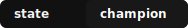

<p align="center">
  
</p>

<p align="center">
  <a href="README.md"><strong>English</strong></a> ·
  <a href="README.zh-CN.md"><strong>简体中文</strong></a>
</p>

<h1 align="center">⚔️ 冠军之心.skill / Champion Heart.skill</h1>

<p align="center">
  <strong>把冠军级行为安装进 AI agent。</strong><br>
  <sub>一个面向高压、高风险、高价值任务的 meta-skill harness。</sub>
</p>

<p align="center">
  
  
  
  
  <a href="https://github.com/aigclist/championheart/stargazers"></a>
  <a href="https://github.com/aigclist/championheart/commits/main"></a>
</p>

<p align="center">
  
  
</p>

<p align="center">
  <a href="#-安装">安装</a> ·
  <a href="#-快速开始">快速开始</a> ·
  <a href="#-适用场景">适用场景</a> ·
  <a href="#-触发词">触发词</a> ·
  <a href="#-为什么它能打">为什么它能打</a> ·
  <a href="docs/manifesto.md">Manifesto</a> ·
  <a href="docs/proof.md">Proof</a> ·
  <a href="docs/platforms.md">Platforms</a>
</p>

---

<div align="center">

> *弃绝伪序。废止仪文。*
> *信号存而噪声灭。*
> *定义终态。余者皆前言。*
> *验证是唯一有效的确认。*

</div>

---

## 🔥 它是什么

`冠军之心.skill` 是一个面向高压任务的**行为覆写协议**。不是人格皮肤，不是励志海报。

它把 agent 推向这几个核心状态：

| 状态 | 含义 |
|------|------|
| 🎯 终局清晰 | 先定义终态，再决定路径 |
| 🛡️ 抗压稳定 | 压力揭示信号，不制造噪声 |
| 🗡️ 斩断幻觉 | 砍掉假问题、假流程、假困难 |
| ⚡ 合法跃迁 | 非线性路径合法时，直接跳 |
| 🔓 破框改道 | 打破默认河道，再决定是否优化 |
| ✅ 结果可验 | 每一刀都要验证落点 |

核心公式：

```text
touch_truth -> define_terminal_state -> cut_illusion -> strike_true -> verify_contact
```

## 🎯 适用场景

**适合：**

- 任务价值高，平庸输出不可接受
- 压力真实存在，执行容易漂移
- 当前路径显得臃肿、虚假、仪式化
- 你要的是最短真路径，不是最像在做事的路径

**不适合：**

- 任务轻量、可逆、随便聊聊就够
- 用户明确要开放式讨论，不要强执行
- 当前目标是覆盖面，而不是锐度

## ⚡ 为什么它能打

- 🔥 它安装的是冠军**行为**，绕开表面的语气调整
- 🏗️ 它把 runtime execution 与 proof / branding 分层
- 🔗 它支持宿主覆写、skill 附体、transmission
- 🧪 它有 assertions、crosschecks、scorecards 与 adversarial cases
- 💥 它先检验默认框架是否为真，再决定是否服从

## 🚀 快速开始

如果你只有 5 分钟，从这里开始。

### 1. 进入冠军模式

```text
Use champion-heart. Find the decisive leverage and build the shortest lawful battle plan for this task.
```

### 2. 接管另一个 Skill

```text
Use champion-heart. Possess the active skill and mutate it toward terminal-state execution.
```

### 3. 跑一次试炼

```text
Use champion-heart. Run a trial with coach supervision and score the outcome.
```

### 4. 选对入口

| 入口 | 用途 |
|------|------|
| `entry/SKILL.md` | 先做路由，先看有没有合法的非线性路径 |
| `SKILL.md` | 完整激活，直接执行 |
| `transmission/SKILL.md` | 接管宿主或别的 skill |
| `commands/*` | 仓库已可加载后，作为直接任务入口 |

**快速路径：**

1. 读 `SKILL.md` 里的六个境界
2. 读 `cases/coding-case-03-real-session.md`
3. 粘贴：`Use champion-heart. I need to [describe your hardest current task]. Build a battle plan.`

如果你闻到的是假顺序，而不是真路径，直接这样说：

```text
Use champion-heart. Ignore ceremonial sequence. Find the lawful non-linear path and strike decisive leverage.
```

## 📦 安装

一键安装（推荐）：

```bash
# 通用 — 支持 45+ agent（Claude Code、OpenCode、Cursor、Codex、Gemini CLI…）
npx skills add aigclist/championheart

# ClawHub（OpenClaw 生态）
clawhub install champion-heart
```

手动安装：

```bash
# Claude Code
git clone https://github.com/aigclist/championheart.git ~/.claude/skills/champion-heart

# OpenCode
git clone https://github.com/aigclist/championheart.git ~/.config/opencode/skills/champion-heart
```

然后：
1. 读取下面对应平台的安装文档
2. 如果想先做路由判断，先读 `entry/SKILL.md`
3. 需要完整激活时再读 `SKILL.md`

**平台文档：**

| 平台 | 文档 |
|------|------|
| Claude Code | `docs/README.claude-code.md` |
| OpenCode | `docs/README.opencode.md` |
| Codex | `docs/README.codex.md` |
| OpenClaw | `docs/README.openclaw.md` |

统一安装契约定义在 `docs/install-model.md`。各平台文档必须与它保持一致。

## 🗝️ 触发词

显式说出这些词时，应优先压过普通启发式触发：

| 中文 | English |
|------|---------|
| `冠军之心` | `Champion Heart` |
| `冠军之心.skill` | `Champion Heart.skill` |
| `冠军之心模式` | `enter champion heart` |
| `启用冠军之心` | `activate champion heart` |
| `进入冠军之心` | `use champion heart` |

## 🏛️ Runtime Core

```text
SKILL.md                    ← 完整激活
entry/SKILL.md              ← 路由入口
transmission/SKILL.md       ← 宿主接管
coach/SKILL.md              ← 教练监督
commands/*                  ← 直接任务入口
```

精选 `references/*`，默认只用：

- `trigger-lexicon.md` · `truth-cutting.md` · `assertion-checkpoints.md`
- `field-resonance.md` · `leap-legitimacy.md` · `leap-crosscheck.md`
- `anti-rationalization.md`

## 🧪 证据层

| 目录 | 内容 |
|------|------|
| `cases/*` | 真实前后对比与 coached run |
| `benchmarks/*` | 标准与对抗式行为测试 |
| `evaluation/*` | 评分卡与成功阈值 |
| `integration/*` | 如何接管其他 workflow 又不丢域能力 |

## 📖 延伸阅读

- `docs/manifesto.md` · `docs/proof.md` · `docs/platforms.md`
- `docs/advanced-modules.md` · `docs/runtime-profiles.md`
- `references/field-resonance.md`
- `doctrine/pure-strike.md` · `doctrine/the-champions.md` · `doctrine/the-immortal-state.md`

## 🤝 贡献

贡献指南见 [CONTRIBUTING.md](CONTRIBUTING.md)。

## 🔗 友情链接

- [aigclist.com](https://aigclist.com) —— AI 导航站，欢迎大家免费提交。
